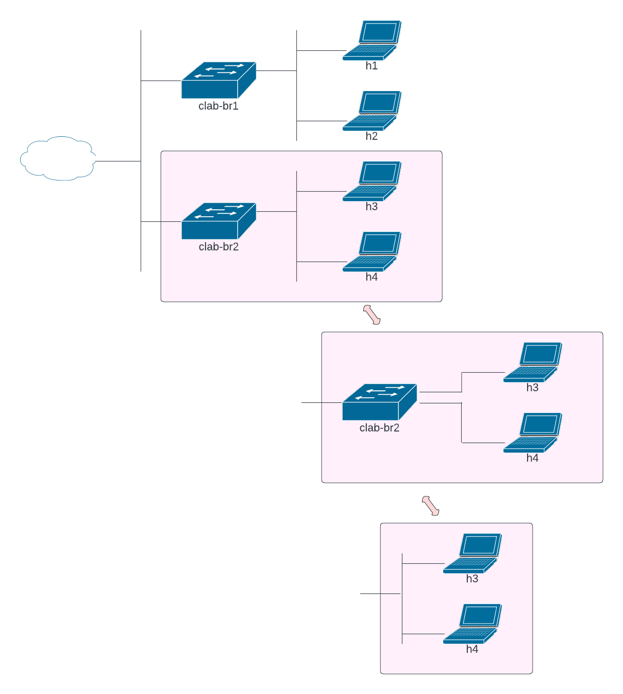

#  Lab Instructions
## Network Topology and Reading deploy.sh
### **Challenge 1: Understanding the Network Diagram**

Network diagrams communicate a lot of information, but only if a reader understands the common conventions used in network diagrams. Figure 1 illustrates the network topology for this lab.

This lab deploys a simple network with two Ethernet switches (clab-br1 and clab-br2) and four Linux hosts (h1 thru h4). Note, the breakout for connections from h3 and h4 to clab-br2. Hosts h3 and h4 are connected to separate ports on clab-br2 but network illustrations normally do not draw those individual connections to the switch. Instead, a single line is drawn to the switch and hosts are connected to a vertical line. For Ethernet, this is understood to represent "home run" connections from each host to the switch. Alternatively, the switches could be removed from the illustration altogether without changing the meaning of the topology. The vertical lines can represent multiple switching layers (core, distribution, and workgroup).

The cloud shows there are details we know exist but are not attempting to illustrate. In this case, there is some type of routng and Network Address Translation (NAT) that happens in the cloud. 


<sub><i>Figure 1. Network Topology</i></sub>
<p></p>
<p></p>

--- 
### **Challenge 2: Reading deploy.sh**

A detailed explanation of deploy.sh is provided in [Script_Explainer](Script_Explainer.md). However, if you can read this bash script without additional assistance, here is a quick summary of what happens in deploy.sh. The script can be examined in four parts:
1. Create and enable Linux bridges, clab-br1 and clab-br2
```
# Create and enable clab_br1
sudo brctl delbr $br1
sudo brctl addbr $br1
sudo ip link set $br1 up
sudo iptables -I FORWARD -i $br1 -j ACCEPT
```
Bridge Control (brctl) is a used to create, delete, manage and inspect Linux bridges. The first command in this string deletes the bridge named in the variable $br1. $br1 was previously defined as clab_br1. The second command creates bridge clab_br1. The third command brings the newly created bridge into the *up* state. Finally, the last step is to configure iptables to forward traffic from clab_br1.

Similar commands are included to create and enable clab_br2.

2. Create the containerlab topology configuration file, lab1.yml
```
# Create and yml file and write to lab1.yml
cat << EOF > $f
name: lab2
topology:
  defaults:
    kind: linux
  kinds:
    linux:
      image: docker.io/akpinar/alpine 
  nodes:
    h1:
      kind: linux
      mgmt_ipv4: 172.20.0.21

    ... Lines ommitted for brevity ...

    links:
    - endpoints: ["h1:eth1", "clab-br1:eth13"]
    
    ... Lines ommitted for brevity ...

mgmt: 
  network: srl-mgmt
  ipv4_subnet: 172.20.0.0/24
  ipv6_subnet: 2001:172:20::/80  
EOF
```
*cat << EOF > $f* creates lab1.yml. Nodes h1 through h4 are created. Each node is created from the *kind* linux, and linux is built from the Docker image docker.io/akpinar/alpine. Finally, nodes h1 through h4 are connected to clab_br1 and clab_br2 in the *links* section.

3. Start the lab network in containerlab
```
sudo clab deploy --topo $f
```
The above command executes as *sudo clab deploy --topo lab1.yml*.

4. Configure IP addresses on h1 through h4
```
# Configure IPs on hosts
d="sudo docker"
l=$(cat $f|grep name: | cut -d " " -f2)
a1=192.168.1.10/24

b1="dev eth1"

h1="clab-$l-h1"

$d exec -it $h1 ip addr add $a1 $b1
```
This last section is broken down to demonstrate how an IP address is configured on a single host, h1. The IP address is configured by running a command on the host h1 use *docker exec*. Host h1 is a Docker container. Either the *container id* or *container name* is required to use *docker exec*. The containerlab lab name is a part of the container name. That lab name is retrieved from lab1.yml and defined as variable *$l*. Finally, the IP address and netmask 192.168.1.10/24 are configured on h1 with the command:
```
sudo docker exec -it clab-lab1-h1 ip addr add 192.168.1.10/24 dev eth1
```
--- 
## Operating the Lab Network
### **Challenge 3: Deploy the Lab Network**
Launch the topology by running the script deploy.sh and **capture a screenshot of the results**.
```
  $ bash deploy.sh
```
Sample output. The topology includes four hosts (h1 through h4). 
```
+---+--------------+--------------+--------------------------+-------+---------+----------------+-------------------
+
| # |     Name     | Container ID |          Image           | Kind  |  State  |  IPv4 Address  |   IPv6 Address    
|
+---+--------------+--------------+--------------------------+-------+---------+----------------+-------------------
+
| 1 | clab-lab2-h1 | f92f02bbb090 | docker.io/akpinar/alpine | linux | running | 172.20.0.21/24 | 2001:172:20::3/80 
|
| 2 | clab-lab2-h2 | 7ba192af6cc7 | docker.io/akpinar/alpine | linux | running | 172.20.0.22/24 | 2001:172:20::4/80 
|
| 3 | clab-lab2-h3 | b7a7d0cc8b58 | docker.io/akpinar/alpine | linux | running | 172.20.0.23/24 | 2001:172:20::5/80 
|
| 4 | clab-lab2-h4 | 356b638a4c8d | docker.io/akpinar/alpine | linux | running | 172.20.0.24/24 | 2001:172:20::2/80 
|
+---+--------------+--------------+--------------------------+-------+---------+----------------+-------------------
+
```
--- 
### **Challenge 4: Examining the network topology and services**

The network uses two **_Linux Bridges_** as Ethernet switch devices: *clab_br1* and *clab_br2*. 
Each host has ssh enabled. Users can connect to ssh using the IPv4 Address, which is a management interface. The management interface on each host is eth0. Each host has a second interface, eth1, which is connected to clab-br1 or clab-br2.
The bridges can be examined with brctl. Command **brctl show** lists existing bridges and localhost interfaces connected to those bridges:
```diff
$ brctl show

bridge name             bridge id               STP enabled     interfaces
br-335a0a1cd5f8         8000.0242e0387690           no          veth0581fd3
                                                                vetha90123d
                                                                vethca2d91b
                                                                vethf06f352
                                                                
-clab-br1               8000.aac1ab03790a           no          eth13
-                                                               eth14
                                                                
-clab-br2               8000.aac1ab4f0bea           no          eth15
-                                                               eth16

docker0                 8000.0242d9304a43           no
```
**Capture a screenshot showing the interfaces connected to clab-br1 and clab-br2.**

--- 
### **Challenge 5: Examining network traffic**

Use **tcpdump** to examine the traffic on an interface, or on a bridge. Tcpdump captures packets on the interface and either displays them in the terminal or writes them to a file. Capture packets on clab-br1 and display them. **Capture a screenshot showing packets forwarded through clab-br1.**
```
$ sudo tcpdump -i clab-br1

tcpdump: verbose output suppressed, use -v or -vv for full protocol decode
listening on clab-br1, link-type EN10MB (Ethernet), capture size 262144 bytes
```
Try capturing a ping request and reply (technically, echo request and echo reply) from h1 to h2. This requires two terminals to your host. Open a second ssh shell.
Start a packet capture on clab-br1.
```
$ sudo tcpdump -i clab-br1
```
Next, ssh into h1 and ping from h1 to h2. The username/password for h1 through h4 is admin/admin. The IP address for h1 is 192.168.1.10 and for h2 is 192.168.1.200. See the topology diagram. **Use CTRL-C to stop the pings.**
```
$ ssh admin@172.20.0.21
h1:~$ ping 192.168.1.200
PING 192.168.1.200 (192.168.1.200) 56(84) bytes of data.
64 bytes from 192.168.1.200: icmp_seq=1 ttl=64 time=0.231 ms
64 bytes from 192.168.1.200: icmp_seq=2 ttl=64 time=0.146 ms
```
Observe the packet capture. Note that we see:
- ARP request from 192.168.1.10 and the corresponding response.
- Two pairs of ICMP echo request and reply.
- ARP request from 192.168.1.200 and the corresponding response.
```
$ sudo tcpdump -i clab-br1
tcpdump: verbose output suppressed, use -v or -vv for full protocol decode
listening on clab-br1, link-type EN10MB (Ethernet), capture size 262144 bytes

23:34:45.731740 ARP, Request who-has 192.168.1.200 tell 192.168.1.10, length 28
23:34:45.731809 ARP, Reply 192.168.1.200 is-at aa:c1:ab:7c:f2:80 (oui Unknown), length 28

23:34:45.731831 IP 192.168.1.10 > 192.168.1.200: ICMP echo request, id 84, seq 1, length 64
23:34:45.731855 IP 192.168.1.200 > 192.168.1.10: ICMP echo reply, id 84, seq 1, length 64

23:34:46.756263 IP 192.168.1.10 > 192.168.1.200: ICMP echo request, id 84, seq 2, length 64
23:34:46.756348 IP 192.168.1.200 > 192.168.1.10: ICMP echo reply, id 84, seq 2, length 64

23:34:50.820182 ARP, Request who-has 192.168.1.10 tell 192.168.1.200, length 28
23:34:50.820205 ARP, Reply 192.168.1.10 is-at aa:c1:ab:91:3c:cc (oui Unknown), length 28
```
Linux net-tools utilities can be used to examine host network configurations. In particular, **ifconfig** lists network interfaces and interface configuration. The following snippet shows the result of ifconfig on h1. Note that eth0 is connected to the management network (IP address 172.20.0.21) and eth1 is connected to clab-br1 (IP address 192.168.1.10). These details can be aggregated with details learned through other methods, such as packet captures, to build an understanding of a network's topology. An alternative to ifconfig is **ip address** or the shortcut **ip a**. 
```
$ ifconfig
eth0      Link encap:Ethernet  HWaddr 02:42:AC:14:00:15  
          inet addr:172.20.0.21  Bcast:172.20.0.255  Mask:255.255.255.0
          inet6 addr: 2001:172:20::3/80 Scope:Global
          inet6 addr: fe80::42:acff:fe14:15/64 Scope:Link
          UP BROADCAST RUNNING MULTICAST  MTU:1500  Metric:1
          RX packets:79 errors:0 dropped:0 overruns:0 frame:0
          TX packets:43 errors:0 dropped:0 overruns:0 carrier:0
          collisions:0 txqueuelen:0 
          RX bytes:9031 (8.8 KiB)  TX bytes:6399 (6.2 KiB)

eth1      Link encap:Ethernet  HWaddr AA:C1:AB:AB:DA:46  
          inet addr:192.168.1.10  Bcast:0.0.0.0  Mask:255.255.255.0
          inet6 addr: fe80::a8c1:abff:feab:da46/64 Scope:Link
          UP BROADCAST RUNNING MULTICAST  MTU:9500  Metric:1
          RX packets:14 errors:0 dropped:0 overruns:0 frame:0
          TX packets:8 errors:0 dropped:0 overruns:0 carrier:0
          collisions:0 txqueuelen:0 
          RX bytes:1436 (1.4 KiB)  TX bytes:656 (656.0 B)

lo        Link encap:Local Loopback  
          inet addr:127.0.0.1  Mask:255.0.0.0
          inet6 addr: ::1/128 Scope:Host
          UP LOOPBACK RUNNING  MTU:65536  Metric:1
```

---
#### **Address Resolution Protocol (ARP)** 
ARP is a TCP/IP Layer 2 protocol used to discover physical MAC addresses associated with logical IP addresses. ARP allows network devices to build and maintain tables that associate dynamic logical addresses with static physical addresses. An *ARP Request* is a Layer 2 broadcast message that requests the owner of a specific IP address to respond to the sender with their physical address. An *ARP Reply* returns the physical address, or MAC address, for the interface with the IP address requested in an ARP Request. The reply is sent to the requesting host.
#### **Internet Control Message Protocol ICMP**
ICMP is an Internet manangement protocol that supports dozens of different message types. *Echo Request* and *Echo Reply* are just two message types. The **ping** command uses Echo Request and Echo Reply to identify live hosts in a network. Hosts are addressed by their logical address. In other words, hosts are addressed by IP address. 
#### **ICMP and ARP Working Together**
The command **ping 192.168.1.10** would send an Echo Request to the IP 192.168.1.10 (H1). Let's assume the source IP is 192.168.1.20 (H2), and that H1 and H2 are in the same network. In this scenario, H2 needs to know the MAC address for H1, so before H2 can send the ICMP Echo Request packet it first needs to send an ARP Request to learn H1's MAC address.
The first frame sent by H2 will be an ARP Request asking who has 192.168.1.10. H1 will respond with an ARP Reply. Now that H2 has the MAC address for H1, H2 will send the ICMP Echo Request. H1 should already know H2's MAC address, which it learned when H2 sent the ARP Request. H1 responds with an Echo Reply. H2 receives the Echo Reply, which communicates that 192.168.1.10 (H1) is a live host.
#### **Capturing Packets with _tcpdump_**
Tcpdump is a Linux utility used to capture and examine packets. We can view packets in the terminal or write those packet to a file and examine them offline using tcpdump or Wireshark. Although tcpdump will let you do deep packet inspection, Wireshark has a GUI and is a much more powerful tool for examining network flows and doing deep packet inspection. Wireshark can be used to examine packet captures saved with tcpdump.

---
## Stretch
### **Challenge 6: Modifying Network Topology in containerlab**
Before attempting this stretch exercise, first destroy the practice network by running the command:
```
$ bash destroy.sh
```
Next, modify the topology to add a new host to the network. Connect the new host to clab-br1 and assign the IP address 172.20.0.25 for management and IP address 192.168.1.150 for passing traffic. The following snippet in deploy.sh creates a host.
```
  nodes:
    h1:
      kind: linux
      mgmt_ipv4: 172.20.0.21
```
The following snippet shows how the configuration of connections from hosts to the bridges clab-br1 and clab-br2.
```
  links:
    - endpoints: ["h1:eth1", "clab-br1:eth13"]
    - endpoints: ["h2:eth1", "clab-br1:eth14"]
    - endpoints: ["h3:eth1", "clab-br2:eth15"]
    - endpoints: ["h4:eth1", "clab-br2:eth16"]
```    
The following snippet shows how IP addresses are assigned to pass traffic in the 192.168.1.0/24 network.
```
# Configure IPs on hosts
d="sudo docker"
l=$(cat $f|grep name: | cut -d " " -f2)
a1=192.168.1.10/24
a2=192.168.1.200/24
a3=192.168.1.15/24
a4=192.168.1.215/24
b1="dev eth1"
b2="dev eth1"
h1="clab-$l-h1"
h2="clab-$l-h2"
h3="clab-$l-h3"
h4="clab-$l-h4"
$d exec -it $h1 ip addr add $a1 $b1
$d exec -it $h2 ip addr add $a2 $b2
$d exec -it $h3 ip addr add $a3 $b1
$d exec -it $h4 ip addr add $a4 $b2
```

1. Modify deploy.sh to add a link a new host.
2. Start the modified lab.
3. Demonstrate that the new host can communicate with h1 and h2. **Capture a screeshot showing successful pings from the new host to h1 and h2.**
4. Examine network traffic on clab-br1 and clab-br2 when attempting to ping H1 and H4 from the new host. Note your observations and offer an explanation of the observed behavior.
5. Destroy the containerlab network.

---
### **Challenge 7: Illustrate Network Topology

Challenge 6 modified the network topology illustrated in Challenge 1. Use diagramming software, such as [Lucidchart](https://www.lucidchart.com/pages/) or Visio or whatever you like to illustrate the network you created in Challenge 6. The diagram should:
1. Name switches and hosts
2. Provide host IP addresses
3. Accruately illustrate the organization of network devices (switches/bridges and hosts)

Both Lucidchart and Visio allow the use of various stencils or shapes. In Lucidcharts, start a drawing, select **Shapes** and **Cisco Network Icons**. In Visio, select **More Shapes** and **Open Stencils**. Open a stencil. You can download Cisco icons from [Cisco](https://www.cisco.com/c/en/us/about/brand-center/network-topology-icons.html).

**Save the network diagram as a pdf, png, or jpg file.** 
