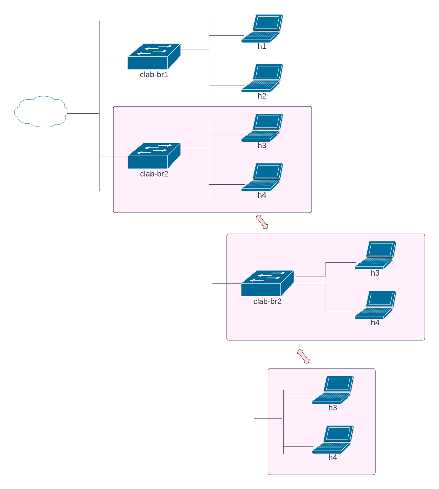

#  Lab Instructions
## Practicing with Ethernet Switches in containerlab & Illustrating a Network Diagram
### **Understanding the Network Diagram**

Network diagrams communicate a lot of information, but only if a reader understands the common conventions used in network diagrams. Figure 1 illustrates the network topology for this lab.

This lab deploys a simple network with two Ethernet switches (clab-br1 and clab-br2) and four Linux hosts (h1 thru h4). Note, the breakout for connections from h3 and h4 to clab-br2. Hosts h3 and h4 are connected to separate ports on clab-br2 but network illustrations normally do not draw those individual connections to the switch. Instead, a single line is drawn to the switch and hosts are connected to a vertical line. For Ethernet, this is understood to represent "home run" connections from each host to the switch. Alternatively, the switches could be removed from the illustration altogether without changing the meaning of the topology. The vertical lines can represent multiple switching layers (core, distribution, and workgroup).

The cloud shows there are details we know exist but are not attempting to illustrate. In this case, there is some type of routng and Network Address Translation (NAT) that happens in the cloud. We would normally just include an empty cloud.


<sub><i>Figure 1. Network Topology</i></sub>
<p></p>
<p></p>

1. Launch the topology by running script deploy.sh
```
  $ bash deploy.sh
```
2. Sample output. The topology includes four hosts (h1 through h4). 
```
+---+--------------+--------------+--------------------------+-------+---------+----------------+-------------------
+
| # |     Name     | Container ID |          Image           | Kind  |  State  |  IPv4 Address  |   IPv6 Address    
|
+---+--------------+--------------+--------------------------+-------+---------+----------------+-------------------
+
| 1 | clab-lab2-h1 | f92f02bbb090 | docker.io/akpinar/alpine | linux | running | 172.20.0.21/24 | 2001:172:20::3/80 
|
| 2 | clab-lab2-h2 | 7ba192af6cc7 | docker.io/akpinar/alpine | linux | running | 172.20.0.22/24 | 2001:172:20::4/80 
|
| 3 | clab-lab2-h3 | b7a7d0cc8b58 | docker.io/akpinar/alpine | linux | running | 172.20.0.23/24 | 2001:172:20::5/80 
|
| 4 | clab-lab2-h4 | 356b638a4c8d | docker.io/akpinar/alpine | linux | running | 172.20.0.24/24 | 2001:172:20::2/80 
|
+---+--------------+--------------+--------------------------+-------+---------+----------------+-------------------
+
```
### **Examining the network topology and services**

3. The network uses two **_Linux Bridges_** as Ethernet switch devices: *clab_br1* and *clab_br2*. 
4. Each host has ssh enabled. Users can connect to ssh using the IPv4 Address, which is a management interface. The management interface on each host is eth0. Each host has a second interface, eth1, which is connected to clab-br1 or clab-br2.
5. The bridges can be examined with brctl. Command **brctl show** lists existing bridges and localhost interfaces connected to those bridges:
```diff
$ brctl show

bridge name             bridge id               STP enabled     interfaces
br-335a0a1cd5f8         8000.0242e0387690           no          veth0581fd3
                                                                vetha90123d
                                                                vethca2d91b
                                                                vethf06f352
                                                                
-clab-br1               8000.aac1ab03790a           no          eth13
-                                                               eth14
                                                                
-clab-br2               8000.aac1ab4f0bea           no          eth15
-                                                               eth16

docker0                 8000.0242d9304a43           no
```
### **Examining network traffic**

6. Use **tcpdump** to examine the traffic on an interface, or on a bridge. Tcpdump captures packets on the interface and either displays them in the terminal or writes them to a file. Capture packets on clab-br1 and display them.
```
$ sudo tcpdump -i clab-br1

tcpdump: verbose output suppressed, use -v or -vv for full protocol decode
listening on clab-br1, link-type EN10MB (Ethernet), capture size 262144 bytes
```
7. Try capturing ping request and reply (technically, echo request and echo reply) from h1 to h2. This requires two terminals to your host. Open a second ssh shell.
8. Start a packet capture on clab-br1.
```
$ sudo tcpdump -i clab-br1
```
10. Next, ssh into h1 and ping from h1 to h2. The username/password for h1 through h4 is admin/admin. The IP address for h1 is 192.168.1.10 and for h2 is 192.168.1.200. See the topology diagram. **Use CTRL-C to stop the pings.**
```
$ ssh admin@172.20.0.21
h1:~$ ping 192.168.1.200
PING 192.168.1.200 (192.168.1.200) 56(84) bytes of data.
64 bytes from 192.168.1.200: icmp_seq=1 ttl=64 time=0.231 ms
64 bytes from 192.168.1.200: icmp_seq=2 ttl=64 time=0.146 ms
```
11. Observe the packet capture. Note that we see:
- ARP request from 192.168.1.10 and the corresponding response.
- Two pairs of ICMP echo request and reply.
- ARP request from 192.168.1.200 and the corresponding response.
```
$ sudo tcpdump -i clab-br1
tcpdump: verbose output suppressed, use -v or -vv for full protocol decode
listening on clab-br1, link-type EN10MB (Ethernet), capture size 262144 bytes

23:34:45.731740 ARP, Request who-has 192.168.1.200 tell 192.168.1.10, length 28
23:34:45.731809 ARP, Reply 192.168.1.200 is-at aa:c1:ab:7c:f2:80 (oui Unknown), length 28

23:34:45.731831 IP 192.168.1.10 > 192.168.1.200: ICMP echo request, id 84, seq 1, length 64
23:34:45.731855 IP 192.168.1.200 > 192.168.1.10: ICMP echo reply, id 84, seq 1, length 64

23:34:46.756263 IP 192.168.1.10 > 192.168.1.200: ICMP echo request, id 84, seq 2, length 64
23:34:46.756348 IP 192.168.1.200 > 192.168.1.10: ICMP echo reply, id 84, seq 2, length 64

23:34:50.820182 ARP, Request who-has 192.168.1.10 tell 192.168.1.200, length 28
23:34:50.820205 ARP, Reply 192.168.1.10 is-at aa:c1:ab:91:3c:cc (oui Unknown), length 28
```
