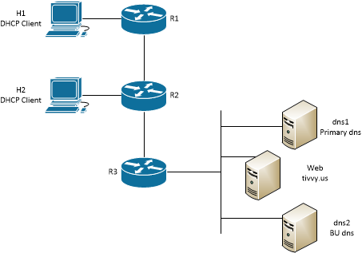

#  Lab Instructions
## Network Services
### Challenge 1: Network Topology

This labs deploys a simple network with routers, DHCP clients, two DNS servers and a web server. IP addresses are configured on the servers and routers. Those IP addresses are not provided in the network Diagram so users must extract those IP addresses from the nodes. 

Users will configure DHCP service and NAT on eth1 interfaces on R1 and R2. Users must manually request a DHCP lease on hosts H1 and H2 after configuring DHCP service and NAT on routers R1 and R2. 

Users will also configure a DNS zone on DNS1 and configure DNS2 to pull that zone from DNS1 through a zone transfer.

Users will finally configure DNS service on R1 and R2 and direct DNS forwarding to DNS1 and DNS2.

<p align="center">

</p>
<p align="center">
<sub><i>Figure 1. Network Topology</i></sub>
</p>

<p></p>
<p></p>

--- 
## Operating the Lab Network
### Challenge 2: Deploy the Lab Network
Launch the topology by running the script deploy.sh.
```
  $ bash deploy.sh
```
--- 
## Challenge 3: Configuring DHCP Service
### Configure a DHCP pool on router LAN interfaces (eth1)

DHCP dnymically configures network services on DHCP clients. A DHCP client requests a *lease* from the DHCP server. The DHCP responds with an IP address and subnet mask, Default Gateway, name servers (DNS servers), lease time and other details. The DHCP client then uses that lease for network communications. Routers R1 and R2 each have a LAN directly connected to eth1. A DHCP pool provides the IP address range and other configuration details the DHCP server will use to issue leases to DHCP clients.

**Configure DHCP pools on R1 and R2 eth1 interfaces**. Use the following configuration deails:

Start IP address (the first IP address in the pool): x.x.x.51
Stop IP address (the last IP address in the pool): x.x.x.150
Lease Expiration of 84600 seconds (24 hours)
Name Server: R1/eth1 address on R1 and R2/eth1 IP address on R2
Gateway: R1/eth1 address on R1 and R2/eth1 IP address on R2

### Manually force a DHCP request from a client

Normally DHCP requests happen automatically when a DHCP client is added to a network, but in this case we will manually force a DHCP request with the **dhclient** command.

Assume R1 is configured with the DHCP server, 
```
set service dhcp-server shared-network-name LAN authoritative
set service dhcp-server shared-network-name LAN subnet 10.10.10.0/24 default-router 10.10.10.1
set service dhcp-server shared-network-name LAN subnet 10.10.10.0/24 lease 84600
set service dhcp-server shared-network-name LAN subnet 10.10.10.0/24 name-server 10.10.10.1
set service dhcp-server shared-network-name LAN subnet 10.10.10.0/24 range 0 start 10.10.10.51
set service dhcp-server shared-network-name LAN subnet 10.10.10.0/24 range 0 start 10.10.10.150
```


--- 
### Challenge 4: Configure RIP on North network

RIP is a distance-vector routing protocol. *Distance* is measured by hops. A *hop* is any routing device. For example, hops include routers, firewalls, and inline network intrusion detection systems (IDS). Hops do not include switches or other Layer 1 or Layer 2 devices. Vyos supports RIPv2. More details about RIP and Vyos' implementation of the protocol can be learned [here](https://blog.vyos.io/the-night-of-living-dead-protocols-ripv2). 

RIP is configured on all interfaces where you want to send and receive advertisements (messages that share routes). Interfaces that have RIP configured will automatically be included in the RIP table. For example, add interface eth2 on r1 to the RIP table with the command:
```
set protocols rip interface eth2
```

Networks on other interfaces can be explicitly added with the **rip network** command.
```
set protocols rip network 10.100.1.0/24
`
**Configure RIP on links between all routers in the North network (N-Link1 and N-Link2). R3:eth3 is included in the North network, R3:eth1 and R3:eth2 are not in the North network. R3:eth1 and :eth2 are in the Central network.**
**Add N-LAN1 and N-LAN2 networks to the rip table using the *rip network* command**

### Challenge 5: Inspect North Network Routing.
Vyos **show ip route** command shows:
- Known routes (outbound interface and next-hop IP address to reach a destination network)
- How those routes were learned (**C**onnected, **K**ernel, **S**tatic, **R**IP, etc)
- Which routes are selected (**>**)

Inspect routes on R3. 
**Report the routes learned by RIP.**

Inspect routes on R1.
1. **Predict if R1 could successfully ping R3:eth1.**
2. **Explain why you think R1 could or could not ping R3:eth1.**

### Challenge 6: Configure OSPF on the Central and South networks
OSPF is a Link-State routing protocol. Link-state routing protocols construct a mathematical model of known networks and the links between nodes. Preferred routes are chosen by the lowest cost routes. Cost in link-state routing protocols generally reflects network performance or capacity, meaning that networks with the greatest network speed have the lowest cost. Routes with the lowest combined cost would be the preferred route to a destination network.

OSPF stores routing information in Link State Databases, consisting of three tables:
- Neighbor table
- Topology table
- Routing table

In very large networks, the detailed information stored by each router can consume enough resources on the routers to impact OSPF protocol, or even node, performance. Therefore, OSPF includes a mechanism to segment large networks into **Areas**. Areas are used to segment OSPF domains in autonomous networks while still being able to shares routes between through Area Border Routers (ABRs). An ABR is any OSPF router that has more than one OSPF area configured. Area 0 is used to identify the *backbone*. 

The backbone (Area 0) is responsible for storing network topology for the OSPF domain and sharing summary route data with non-backbone areas. Every ABR router should have at least one connection to the backbone. Virtual links can be used to share routes between non-backbone areas that do not have a physical connection to the backbone, but we will not practice that method.

Some key terms and concepts in OSPF.
**OSPF Neighbors:** OSPF neighbors are adjacent routers (routers that share a link). Fully adjacent neighbors are routers that are a) have the same subnet configured, b) area ID, c) hellow and dead interval timers, and d) same authentication if used. Fully adjacent neighbors share link state tables.
**Router ID:** Every OSPF router in a network must have a unique router ID. Duplicate router IDs create link state model instabilities and subsequently create routing problems. An OSPF router ID looks similar to an IPv4 IP address, so it is possible to use an IP address configured on each router as the router ID. This practice avoids duplicate router IDs.

Configuring OSPF on Vyos normally requires three commands. First, assign the router ID. Second, assign router interfaces to an OSPF area. Third, enable logging (optional). Additional information on Vyos OSPF can be found [here](https://support.vyos.io/en/kb/articles/how-to-configure-ospf-virtual-links-2)
```
set protocols ospf parameters router-id '192.168.0.1'
set protocols ospf area 1 network '192.168.0.0/30'
set protocols ospf log-adjacency-changes
```
**Configure OSPF on routers in Central and South networks.**
- **Add router interfaces in Central network to OSPF area 0**
- **Add router interfaces in South network to OSPF area 1.**
- **NOTE: R6 is an ABR. Interfaces eth1 and eth2 are in OSPF area 0, interfaces eth3 and eth3 are in OSPF area 1.

### Challenge 7: Inspect Routing in Central and South Networks.
Inspect routes on R5 and R8. 
**Report the routes learned by OSPF.**

Inspect routes on R1.
1. **Predict if R3 could successfully ping R8:eth1.**
2. **Explain why you think R3 could or could not ping R3:eth1.**
3. **Predict if R1 could successfully ping R4:eth1.**
4. **Explain why you think R1 could or could not ping R4:eth1.**

### Challenge 8: Route redistribution
Compare the routes on R3 to those known on any other router. Note that R3 knows routes to every network in the topology, but R1 and R2 only know routes learned by RIP and R4 through R8 only know routes learned by OSPF. Routes learned by one protocol need to be **redistributed** to the other protocols. For example, routes learned by RIP need to be redistributed to OSPF, and routes learned by OSPF need to be redistributed to RIP. 

Configure route redistribution on the router(s) that learn routes by more than one routing protocol. In this case, that is R3.

**Redistribute RIP routes to OSPF:**
```
set protocols rip redistribute ospf
```

**Redistribute OSPF routes to RIP:**
```
set protocols ospf redistribute rip
```

After configuring redistribution between RIP and OSPF, you should see *almost* all networks learned on every router. However, you will see that 10.0.0.4/30 is not learned in Central and South networks. Examine the method used to learn that route on R3, note that 10.0.0.4/30 is learned only by **Connected**. Although 10.0.0.4/30 is configured by RIP, R3 did not learn that network by RIP. 

**Using the skills you learned to redistribute RIP routes to OSPF, redistribute 10.0.0.4/30 (connected vs rip) to OSPF.**

#### Challenge 9: Prove all routes are known throughout the network
**Capture a screenshot of successful pings from R1 to S-LAN1 and R1 to S-LAN2.
