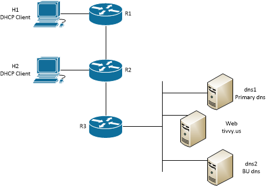

#  Lab Instructions
## Network Services
### Challenge 1: Network Topology

This labs deploys a simple network with routers, DHCP clients, two DNS servers and a web server. IP addresses are configured on the servers and routers. Those IP addresses are not provided in the network Diagram so users must extract those IP addresses from the nodes. 

Users will configure DHCP service and NAT on eth1 interfaces on R1 and R2. Users must manually request a DHCP lease on hosts H1 and H2 after configuring DHCP service and NAT on routers R1 and R2. 

Users will also configure a DNS zone on DNS1 and configure DNS2 to pull that zone from DNS1 through a zone transfer.

Users will finally configure DNS service on R1 and R2 and direct DNS forwarding to DNS1 and DNS2.

<p align="center">

</p>
<p align="center">
<sub><i>Figure 1. Network Topology</i></sub>
</p>

<p></p>
<p></p>

--- 
## Operating the Lab Network
### Challenge 2: Deploy the Lab Network
Launch the topology by running the script deploy.sh and manually launch the http service on the web server.
```
  $ bash deploy.sh
  $ sudo docker exec -it clab-lab1-web /httpd.sh

Confirm that you can browse to the web server
  
  $ sudo docker exec -it clab-lab1-web ifconfig eth0
  $ curl http://<web eth0 ip address>
```
--- 
## Challenge 3: Configuring DHCP Service
### Configure DHCP service on R1/eth1 and R2/eth2 and obtain leases on H1 and H2

This skill was practiced in the practice lab. Correctly configure DHCP service on R1 and R2 and force the two hosts H1 and H2 to obtain a DHCP lease. 

**Capture a screenshot(s) showing dhcp server statistics and leases on R1 and R2.**

## Challenge 4, Source NAT (SNAT) configuration
SNAT is the most common form of NAT. When network administrators refer to NAT, they are almost always specifically talking about SNAT. SNAT enables multiple internal or private hosts to access the Internet by sharing a single public IP address of a SNAT router. What we commonly refer to as NAT is actually SNAT and uses address translation (NAT), port translation (PAT) and address masquerading. The following commands assume the internal range is 192.168.1.0/24 and the external (public) IP is 150.10.1.1 on eth0, and show SNAT configuration on Vyos under those conditions.

```
set nat source rule 10 outbound-interface eth0
set nat source rule 10 source address 192.168.1.0/24
set nat source rule 10 translation address 'masquerade'
```
**Configure Source NAT (SNAT) on R1. NAT traffic from R1/eth1 to R1/eth2. R1/eth1 is the NAT source and R1/eth2 is the NAT outbound interface.**

## Challenge 5, Observe operational difference between SNAT and non-NAT networks
1. Open two SSH terminals to your Ubuntu VM.
2. On one terminal, open a bash shell to R3.
```
sudo docker exec -it clab-lab2-r3 bash
```
3. On the second terminal, open a shell to H2.
4. On R3, start tcpdump on eth1 and filter for just ICMP traffic.
```
tcpdump -i eth1 -p icmp
```
5. On H2, ping R3/eth3. You can stop the ping after one or two responses.
6. Observe the **source IP address** on the **ICMP echo request** packets. Those are packets transmitted by H2.
7. Exit H2 and get a shell on H1.
8. On H1, ping R3/eth3. You can stop the ping after one or two responses.
9. Observe the **source IP address** on the **ICMP echo request** packets. Those are packets transmitted by H1.
10. **Capture a screenshot of the packet capture on R3.**
11. **Explain the difference between source IP addresses of packets captured from H1 and H2.**

## Challenge 6, DNS forwarding
DNS forwarding configures a DNS server to forward requests it cannot resolve to an upstream DNS server.

**Configure DNS forwarding on R1 and R2 to DNS server 8.8.8.8.

The basic commands to configure DNS forwarding on Vyos are:
```
set service dns forwarding system
set service dns forwarding dhcp <interface>
set service dns forwarding name-server <address> 
```
