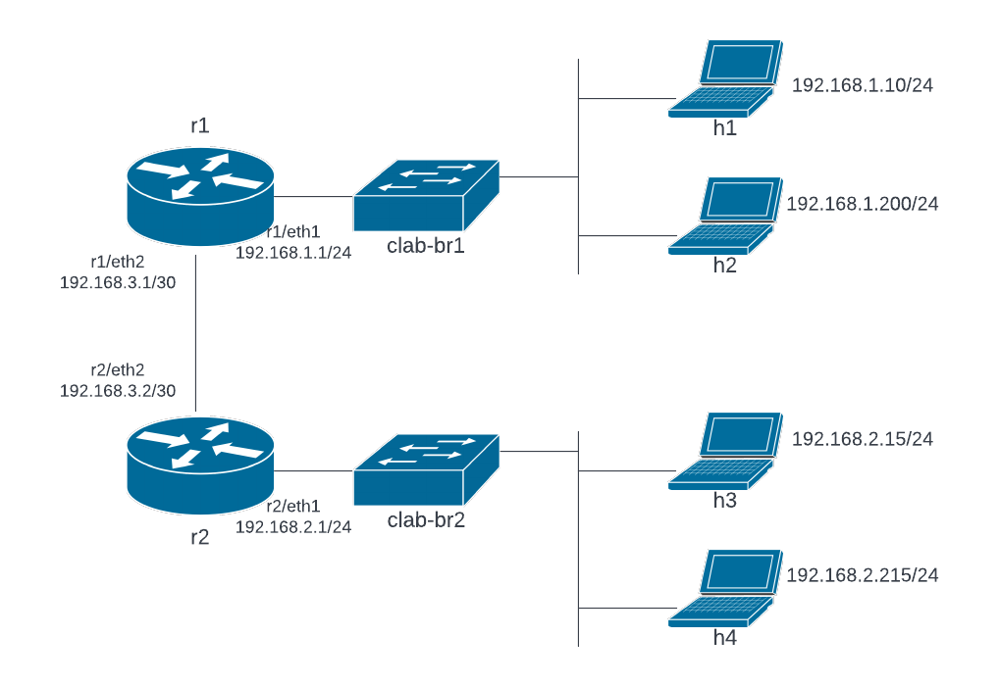

#  Lab Instructions
## Network Topology and Reading deploy.sh
### Challenge 1: Network Topology

This lab deploys a simple network with two routers (r1 and r2), two Ethernet switches (clab-br1 and clab-br2) and four Linux hosts (h1 thru h4). Hosts h1 and h2 are in the same network (192.168.1.0/24), and r1 eth1 is the **default gateway** for that network. **A default gateway is the designated first hop for all traffic out of a network when no higher priority route is configured. In essence, traffic destined to hosts outside of the local network are forwarded to the default gateway. The default gateway is responsible for forwarding traffic to other networks.** Hosts h3 and h4 are in 192.168.2.0/24 and r2 eth1 is the default gateway for h3 and h4. Routers r1 and r2 are connected via an Ethernet link. The link connects to interface eth2 on each router.

IP addresses and default gateways are configured on h1 through h4 when the network is deployed. At the time the network is deployed, routers r1 and r2 are not configured. The interfaces on r1 and r2 are not configured with IP addresses and there are no routes configured.


<sub><i>Figure 1. Network Topology</i></sub>
<p></p>
<p></p>

--- 
## Operating the Lab Network
### Challenge 2: Deploy the Lab Network
Launch the topology by running the script deploy.sh and **capture a screenshot of the results**.
```
  $ bash deploy.sh
```
--- 
### Challenge 3: Examining host configuration

The host and router nodes in this lab do not have an SSH server running. *Docker exec* will be used to gain shell access to the nodes in this lab.
```
docker exec syntax:
 sudo docker exec -it <CONTAINER-NAME or CONTAINER-ID> bash

Example (getting shell in host h1):
 $ sudo docker exec -it clab-lab1-h1 bash
```
Get a shell on h1 and run the following commands. **Capture a screenshot of the results**. 

Examine the results of the **route** command. 
```
bash-5.1# ifconfig eth1
bash-5.1# route
```
Note interface eth1 has IP address 192.168.1.10 and Mask 255.255.255.0. This can also be annotated as 192.168.1.10/24. 

Note the *default route to Gateway 192.168.1.1*. As shown in the network topology, IP address 192.168.1.1 is r1 eth1. The destination IP address in a route is referred to as the **next-hop**, meaning that traffic forwarded to that route is sent to the next-hop router, in this case 192.168.1.1. A **route** is the series of hops (routers) used to forward a packet from the source to the destination.

--- 
### Challenge 4: Examining network traffic

Start network testing from h1. We know IP addresses on the hosts are configured, so test network connectivity from h1 to h2, h3 and h4 using the ping command. Note the results.
```
bash-5.1# ping 192.168.1.200
bash-5.1# ping 192.168.2.15
bash-5.1# ping 192.168.2.215
```
Pings were successful from h1 to h2, but failed to h3 and h4. Although we know r1 is not configured, try to ping 192.168.1.1 and note the response. Are the responses different from the failed pings to h3/h4 and r1?

---
### Challenge 5: Configure Default Gateway Interfaces
Interface eth1 on r1 and r2 are used as the default gateways to networks 192.168.1.0/24 and 192.168.2.0/24. However, those interfaces are not configured. This challenge introduces you interface configuration on FRRouting routers. Routers r1 and r2 are Linux containers. FRRouting runs inside those containers. The containers do not have an SSH server installed or running, so use **docker exec** to obtain a shell in r1. 
```
$ sudo docker exec -it clab-lab1-r1 bash
bash-5.0# 
```
With a shell in r1, use the command **vtysh** to get a shell in FRRouting. This will enter VTY View & Enable Mode (VTY view/enable).
```
bash-5.0# vtysh
% Can't open configuration file /etc/frr/vtysh.conf due to 'No such file or directory'.

Hello, this is FRRouting (version 7.5_git).
Copyright 1996-2005 Kunihiro Ishiguro, et al.

r1# 
```
Examine the running configuration.
```
r1# show running
Building configuration...
Current configuration:
!
frr version 7.5_git
frr defaults traditional
hostname r1
no ipv6 forwarding
!
line vty
!
end
```
Note that there currently are no interfaces configured. So, configure eth1 (the default gateway). To configure an interface, go to configure mode (**configure terminal**). Note, FRRouting supports truncated commands (conf t in place of configure terminal), the select an interface to configure (**interface eth1** or int eth1).

Use the **ip address** command to configure the interface. For example, **ip add 192.168.1.1/24**.
```
r1# conf t
r1(config)# int eth1
r1(config-if)# ip add 192.168.1.1/24
```
Use the **exit** command twice to return to VTY view/enable mode and run the **show run** command again.
```
r1(config-if)# exit
r1(config)# exit
r1# show run
Building configuration...
Current configuration:
!
frr version 7.5_git
frr defaults traditional
hostname r1
no ipv6 forwarding
!
interface eth1
 ip address 192.168.1.1/24
!
line vty
!
end
```
Note interface eth1 has the IP address and subnet mask configured. Test network operation again.

---
### Challenge 6: Test the Default Gateway

Now that interface eth1 on r1 is configured, hosts h1 and h2 should be able to communicate with that interface. Traffic to any destination outside of the local network for h1 and h2 (192.168.1.0/24) should be forwarded to the default gateway. Ping will demonstrate the default gateway is up and traceroute will demonstrate that traffic to external networks is forwarded from the host to the default gateway. These tests are demonstrated below. Pings to the default gateway are successful and traceroute to an external destination uses 192.168.1.1 as the first hop. Not surprisingly, subsequent hops do not respond. 

Router r1 currently only has one interface configured and no routes configured or learned. As a result, r1 simply drops the all packets to 8.8.8.8. The packets are reaching r1, but are immediately dropped by r1.
```
bash-5.1# ping 192.168.1.1
PING 192.168.1.1 (192.168.1.1) 56(84) bytes of data.
64 bytes from 192.168.1.1: icmp_seq=1 ttl=64 time=0.426 ms
64 bytes from 192.168.1.1: icmp_seq=2 ttl=64 time=0.182 ms
64 bytes from 192.168.1.1: icmp_seq=3 ttl=64 time=0.170 ms
^C
--- 192.168.1.1 ping statistics ---
3 packets transmitted, 3 received, 0% packet loss, time 2025ms
rtt min/avg/max/mdev = 0.170/0.259/0.426/0.117 ms
bash-5.1# traceroute 8.8.8.8
traceroute to 8.8.8.8 (8.8.8.8), 30 hops max, 46 byte packets
 1  192.168.1.1 (192.168.1.1)  0.011 ms  0.007 ms  0.007 ms
 2  *  *  *
 3  *  *  *
```
### Challenge 7: Configure and Test r1 eth2

The link between r1 and r2 terminates on interface eth2 of each router. The subnet 192.168.3.0/30 is reserved for the link between r1 and r2. The subnet has two assignable IP addresses, 192.168.3.1 and 192.168.3.2. Configure r1 eth2 with 192.168.3.1, as shown in the network diagram.

Configuring r1 eth2:
```
bash-5.0# vtysh
% Can't open configuration file /etc/frr/vtysh.conf due to 'No such file or directory'.

Hello, this is FRRouting (version 7.5_git).
Copyright 1996-2005 Kunihiro Ishiguro, et al.

r1# conf t
r1(config)# int eth2
r1(config-if)# ip address 192.168.3.1/30
r1(config-if)# exit
r1(config)# exit
r1# exit
```
Testing r1 eth2 from h1:
```
bash-5.1# hostname
h1
bash-5.1# ping 192.168.3.1
PING 192.168.3.1 (192.168.3.1) 56(84) bytes of data.
64 bytes from 192.168.3.1: icmp_seq=1 ttl=64 time=0.182 ms
64 bytes from 192.168.3.1: icmp_seq=2 ttl=64 time=0.116 ms
64 bytes from 192.168.3.1: icmp_seq=3 ttl=64 time=0.123 ms
^C
--- 192.168.3.1 ping statistics ---
3 packets transmitted, 3 received, 0% packet loss, time 2043ms
rtt min/avg/max/mdev = 0.116/0.140/0.182/0.029 ms
```

Next, run traceroute to r1 eth2, but first a word about traceroute operation. Traceroute uses echo requests with TTL values initially set at 1 and incrementing by 1 to identify hops. Each hop (router) that receives a packet decrements the TTL by 1 and forwards the packet to the destination. When TTL decrements to zero (0), the hop that decremented TTL to zero drops the packet and returns an ICMP type 11-Time Exceeded error to the source of the dropped packet. The node that receives the Time Exceeded error examines records the sender of the error as a hop, increments the TTL by 1 and sends the next echo request. The process continues until the echo request reaches the target host in the traceroute.

**Each hop will respond only one time.** This is an important nuance to understand. Normally the interface returning the ICMP type 11-Time Exceeded error will be the first interface encountered on the router. For example, the first interface receiving traceroute requests from h1 will be the default gateway, r1 eth1. However, if the destination IP address is assigned to an interface on the hop, that interface will respond. Consider a traceroute from h1 to 192.168.3.1. IP address 192.168.3.1 is assigned to r1 eth2, so the interface that will respond as the first hop to a traceroute to 192.168.3.1 will be r2 eth2. Let's demonstrate that behavior.
```
bash-5.1# traceroute 192.168.3.1
traceroute to 192.168.3.1 (192.168.3.1), 30 hops max, 46 byte packets
 1  192.168.3.1 (192.168.3.1)  0.010 ms  0.009 ms  0.006 ms
```
## Challenge 8: Configure and Test r2

Using the network diagram and experience gained by configuring r1, configure interfaces eth1 and eth2 on r2. Demonstrate the ability to ping from h3/h4 to r2 eth1 and eth2. **Capture a screenshot showing successful pings from h3 to r2 eth1 and eth2.**

## Challenge 9: Configuring Static Routes on r1 and r2
Interfaces on routers r1 and r2 are configured and tests demonstrate that hosts h1 through h4 can communicate with both interfaces eth1 and eth2 on their default gateways. We can also demonstrate that the link between r1 and r2 is operational by pinging from r1 to 192.168.3.2 (r2) and from r2 to 192.168.3.1 (r1), as shown here.
```
r2# ping 192.168.3.1
PING 192.168.3.1 (192.168.3.1): 56 data bytes
64 bytes from 192.168.3.1: seq=0 ttl=64 time=0.936 ms
64 bytes from 192.168.3.1: seq=1 ttl=64 time=0.104 ms
```

However, a ping from any host across the link between r1 and r2 fails. For example, h1 can ping to 192.168.3.1 succeeds but a ping to 192.168.3.2 fails. This result is observed even when we know the link between r1 and r2 is up and functional. The failure is a *routing problem*. Routers r1 and r2 do not know routes to any network other than local networks. First, let's demonstrate the routing problem.

**Successful pings from h1 to r1 and a failed ping from h1 to r2.**
```
bash-5.1# hostname
h1
bash-5.1# ping 192.168.1.1
PING 192.168.1.1 (192.168.1.1) 56(84) bytes of data.
64 bytes from 192.168.1.1: icmp_seq=1 ttl=64 time=0.270 ms
64 bytes from 192.168.1.1: icmp_seq=2 ttl=64 time=0.192 ms
^C
--- 192.168.1.1 ping statistics ---
2 packets transmitted, 2 received, 0% packet loss, time 1023ms
rtt min/avg/max/mdev = 0.192/0.231/0.270/0.039 ms
bash-5.1# ping 192.168.3.1
PING 192.168.3.1 (192.168.3.1) 56(84) bytes of data.
64 bytes from 192.168.3.1: icmp_seq=1 ttl=64 time=0.162 ms
64 bytes from 192.168.3.1: icmp_seq=2 ttl=64 time=0.078 ms
^C
--- 192.168.3.1 ping statistics ---
2 packets transmitted, 2 received, 0% packet loss, time 1018ms
rtt min/avg/max/mdev = 0.078/0.120/0.162/0.042 ms
bash-5.1# ping 192.168.3.2
PING 192.168.3.2 (192.168.3.2) 56(84) bytes of data.
^C
--- 192.168.3.2 ping statistics ---
4 packets transmitted, 0 received, 100% packet loss, time 3073ms

```
**Successful pings from r1 to r2, demonstrating the link is UP**
```
r1# ping 192.168.3.1
PING 192.168.3.1 (192.168.3.1): 56 data bytes
64 bytes from 192.168.3.1: seq=0 ttl=64 time=0.110 ms
^C
--- 192.168.3.1 ping statistics ---
1 packets transmitted, 1 packets received, 0% packet loss
round-trip min/avg/max = 0.110/0.110/0.110 ms

r1# ping 192.168.3.2     
PING 192.168.3.2 (192.168.3.2): 56 data bytes
64 bytes from 192.168.3.2: seq=0 ttl=64 time=0.192 ms
64 bytes from 192.168.3.2: seq=1 ttl=64 time=0.110 ms
64 bytes from 192.168.3.2: seq=2 ttl=64 time=0.114 ms
^C
--- 192.168.3.2 ping statistics ---
3 packets transmitted, 3 packets received, 0% packet loss
round-trip min/avg/max = 0.110/0.138/0.192 ms

```
Next, examine routes on r1 using the command **show ip route**.
```
r1# show ip route
Codes: K - kernel route, C - connected, S - static, R - RIP,
       O - OSPF, I - IS-IS, B - BGP, E - EIGRP, N - NHRP,
       T - Table, v - VNC, V - VNC-Direct, A - Babel, D - SHARP,
       F - PBR, f - OpenFabric,
       > - selected route, * - FIB route, q - queued, r - rejected, b - backup

K>* 0.0.0.0/0 [0/0] via 172.20.0.1, eth0, 20:40:48
C>* 172.20.0.0/24 is directly connected, eth0, 20:40:48
C>* 192.168.1.0/24 is directly connected, eth1, 20:09:28
C>* 192.168.3.0/30 is directly connected, eth2, 00:58:19
```
We see three directly connected networks. These are the local networks 192.168.1.0/24 and 192.168.3.0/30 that we configured. Network 172.20.0.0/24 is Docker's management network, but is also the default route to the Internet. However, note that their is no route to 192.168.2.0/24. As a result, any packet received that is destined to 192.168.2.0/24 will be forwarded out the default route (if configured) or dropped. 

Recall though, the problem is that pings from h1 to 192.168.3.2 fail. The problem is on r2, not r1. Just like r1 does not have a route to 192.168.2.0/24, r2 does not have a route to 192.168.1.0/24. The packet will be forwarded from r1 to r2, but when r2 attempts to respond, it finds there is no route to 192.168.1.0/24, and would therefore send the response out its default route. We can prove this theory by configuring a **static route** to 192.168.1.0/24 on r2. Let's try.

**On r2:**
```
r2# conf t
r2(config)# ip route 192.168.1.0/24 192.168.3.1
r2(config)# exit

r2# show ip route
Codes: K - kernel route, C - connected, S - static, R - RIP,
       O - OSPF, I - IS-IS, B - BGP, E - EIGRP, N - NHRP,
       T - Table, v - VNC, V - VNC-Direct, A - Babel, D - SHARP,
       F - PBR, f - OpenFabric,
       > - selected route, * - FIB route, q - queued, r - rejected, b - backup

K>* 0.0.0.0/0 [0/0] via 172.20.0.1, eth0, 20:52:58
C>* 172.20.0.0/24 is directly connected, eth0, 20:52:58
S>* 192.168.1.0/24 [1/0] via 192.168.3.1, eth2, weight 1, 00:00:15
C>* 192.168.2.0/24 is directly connected, eth1, 00:34:22
C>* 192.168.3.0/30 is directly connected, eth2, 00:34:04
```

**Test communication to 192.168.3.2 from h1**
```
bash-5.1# hostname
h1
bash-5.1# ping 192.168.3.2
PING 192.168.3.2 (192.168.3.2) 56(84) bytes of data.
64 bytes from 192.168.3.2: icmp_seq=1 ttl=63 time=0.173 ms
64 bytes from 192.168.3.2: icmp_seq=2 ttl=63 time=0.106 ms
^C
--- 192.168.3.2 ping statistics ---
2 packets transmitted, 2 received, 0% packet loss, time 1012ms
rtt min/avg/max/mdev = 0.106/0.139/0.173/0.033 ms
```
