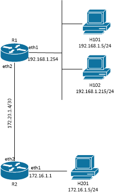

#  Lab Instructions
## Network Topology and Reading deploy.sh
### Challenge 1: Network Topology

This lab deploys a simple network with routers (r1, r2 and r3), Ethernet switches, and Linux hosts.

IP addresses and default gateways are configured on the hosts when the network is deployed. Routers are also configured at the time the network is deployed. However, the routers have configuration errors when the network is initially deployed. The total number of errors is not disclosed. Continue troubleshooting until you are confident that all problems are solved. All problems are solved when all hosts can communicate.

<p align="center">

</p>
<p align="center">
<sub><i>Figure 1. Network Topology</i></sub>
</p>

<p></p>
<p></p>

--- 
## Operating the Lab Network
### Challenge 2: Deploy the Lab Network
Launch the topology by running the script deploy.sh.
```
  $ bash deploy.sh
```
--- 
## Trooubleshoot Network and Correct Errors
### Challenge 3: Test and troubleshoot the network

*Docker exec* will be used to gain shell access to the nodes in this lab.
```
docker exec syntax:
 sudo docker exec -it <CONTAINER-NAME or CONTAINER-ID> bash

Example (getting shell in host h101):
 $ sudo docker exec -it clab-lab1-h101 bash
```
Get a shell on the hosts and test network operation. When all problems are resolved, all hosts will be able to communicate with all other hosts and routers. 

Identify and correct configuration errors on the routers. For each error, record the following:
1. Symptoms related to the configuration error
2. Faulty configuration setting.
3. Correct configuration setting
4. Steps/commands taken to correct the configuration error
5. Proof that the problem is resolved, **Capture a screenshot showing the problem is resolved**

It is possible that you might further break the network while troubleshooting. If so and you are unable to recover the network, simply destroy the network and start over. Keep good notes on what worked and what didn't work to minimize the rework in the event you have to start over.

### Challenge 4: Proof that all errors are corrected

Demonstrate that all problems are resolved. **Capture screenshots that prove all problems are resloved. This may take multiple tests. Students need to select and run the tests that demonstrate the network is functioning correctly.**
