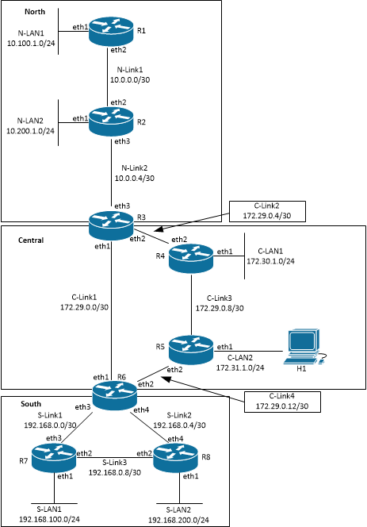

#  Lab Instructions
## Network Topology
### Challenge 1: Network Topology

This lab deploys eight routers organized into three networks (North, Central and South). 

IP addresses are correctly configured on the router interfaces and host H1 has the an IP address and default gateway correctly configured. However, the routers only know the default Kernel routes and directly connected routes. No other routes are configured or known.

<p align="center">

</p>
<p align="center">
<sub><i>Figure 1. Network Topology</i></sub>
</p>

<p></p>
<p></p>

--- 
## Operating the Lab Network
### Challenge 2: Deploy the Lab Network
Launch the topology by running the script deploy.sh.
```
  $ bash deploy.sh
```
--- 
## Testing Network Function
### Challenge 3: Test network operation

*Docker exec* will be used to gain shell access to the nodes in this lab.
```
docker exec syntax:
 sudo docker exec -it <CONTAINER-NAME or CONTAINER-ID> bash

Example (getting shell in host h1):
 $ sudo docker exec -it clab-lab1-h1 bash
```
Get a shell on H1 and run the following commands. 

Attempt to ping the following and note the results:
- r5:eth1
- r5:eth2
- r5:eth3
- r4:eth3
- r6:eth2

1. **Report the results from attempted pings from h1 to r4, r5 and r6 interfaces.** 
2. **Describe which pings failed and which succeeded.**
3. **Explain why some pings failed and others succeeded.**

--- 
### Challenge 4: Configure RIP on North network

RIP is a distance-vector routing protocol. *Distance* is measured by hops. A *hop* is any routing device. For example, hops include routers, firewalls, and inline network intrusion detection systems (IDS). Hops do not include switches or other Layer 1 or Layer 2 devices. Vyos supports RIPv2. More details about RIP and Vyos' implementation of the protocol can be learned [here](https://blog.vyos.io/the-night-of-living-dead-protocols-ripv2). 

RIP is configured on all interfaces where you want to send and receive advertisements (messages that share routes). Interfaces that have RIP configured will automatically be included in the RIP table. For example, add interface eth2 on r1 to the RIP table with the command:
```
set protocols rip interface eth2
```

Networks on other interfaces can be explicitly added with the **rip network** command.
```
set protocols rip network 10.100.1.0/24
```
**Configure RIP on links between all routers in the North network (N-Link1 and N-Link2). R3:eth3 is included in the North network, R3:eth1 and R3:eth2 are not in the North network. R3:eth1 and :eth2 are in the Central network.**
**Add N-LAN1 and N-LAN2 networks to the rip table using the *rip network* command**

### Challenge 5: Inspect North Network Routing.
Vyos **show ip route** command shows:
- Known routes (outbound interface and next-hop IP address to reach a destination network)
- How those routes were learned (**C**onnected, **K**ernel, **S**tatic, **R**IP, etc)
- Which routes are selected (**>**)

Inspect routes on R3. 
**Report the routes learned by RIP.**

Inspect routes on R1.
1. **Predict if R1 could successfully ping R3:eth1.**
2. **Explain why you think R1 could or could not ping R3:eth1.**

### Challenge 6: Configure OSPF on the Central and South networks
OSPF is a Link-State routing protocol. Link-state routing protocols construct a mathematical model of known networks and the links between nodes. Preferred routes are chosen by the lowest cost routes. Cost in link-state routing protocols generally reflects network performance or capacity, meaning that networks with the greatest network speed have the lowest cost. Routes with the lowest combined cost would be the preferred route to a destination network.

OSPF stores routing information in three tables:
- Neighbor table
- Topology table
- Routing table

In very large networks, the detailed information stored by each router can consume enough resources on the routers to impact OSPF protocol performance. Therefore, OSPF includes a mechanism to segment large networks into *Areas*. Areas are used to segment autonomous networks while still being able to shares routes between the networks through Area Border Routers (ABRs). An ABR is any OSPF router that has more than one OSPF area configured.

Some key terms and concepts in OSPF.
**OSPF Neighbors:** OSPF neighbors are adjacent routers (routers that share a link). Fully adjacent neighbors are routers that are a) have the same subnet configured, b) area ID, c) hellow and dead interval timers, and d) same authentication if used. Fully adjacent neighbors share link state tables.
**Router ID:** Every OSPF router in a network must have a unique router ID. Duplicate router IDs create link state model instabilities and subsequently create routing problems. An OSPF router ID looks similar to an IPv4 IP address, so it is possible to use an IP address configured on each router as the router ID. This practice avoids duplicate router IDs.

Configuring OSPF on Vyos normally requires three commands. First, assign the router ID. Second, assign router interfaces to an OSPF area. Third, enable logging (optional). Additional information on Vyos OSPF can be found [here](https://support.vyos.io/en/kb/articles/how-to-configure-ospf-virtual-links-2)
```
set protocols ospf parameters router-id '192.168.0.1'
set protocols ospf area 1 network '192.168.0.0/30'
set protocols ospf log-adjacency-changes
```
**Configure OSPF on routers in Central and South networks.**
- **Add router interfaces in Central network to OSPF area 1**
- **Add router interfaces in South network to OSPF area 2.**
- **NOTE: R6 is an ABR. Interfaces eth1 and eth2 are in OSPF area 1, interfaces eth3 and eth3 are in OSPF area 2.

### Challenge 7: Inspect Routing in Central and South Networks.
Inspect routes on R5 and R8. 
**Report the routes learned by OSPF.**

Inspect routes on R1.
1. **Predict if R3 could successfully ping R8:eth1.**
2. **Explain why you think R3 could or could not ping R3:eth1.**
3. **Predict if R1 could successfully ping R4:eth1.**
4. **Explain why you think R1 could or could not ping R4:eth1.**
