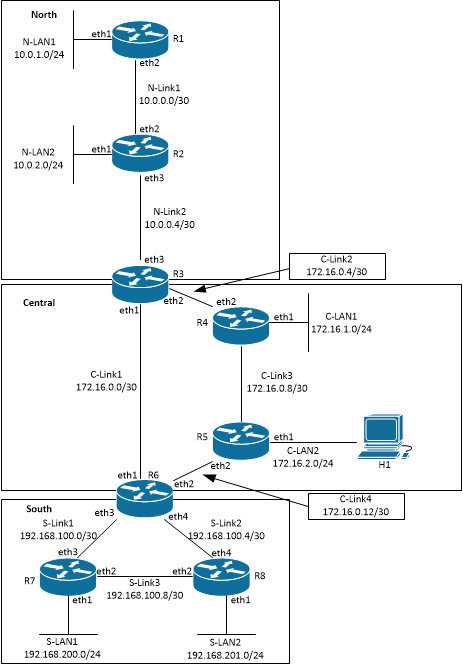

#  Lab Instructions
## Network Topology
### Challenge 1: Network Topology

This lab deploys eight routers organized into three networks (North, Central and South). 

IP addresses are correctly configured on the router interfaces and host H1 has the IP address and default gateway correctly configured. However, the routers only know the default Kernel routes and directly connected routes. No other routes are configured or known.

<p align="center">

</p>
<p align="center">
<sub><i>Figure 1. Network Topology</i></sub>
</p>

<p></p>
<p></p>

--- 
## Operating the Lab Network
### Challenge 2: Deploy the Lab Network
Launch the topology by running the script deploy.sh.
```
  $ bash deploy.sh
```
--- 
## Trooubleshoot Network and Correct Errors
### Challenge 3: Configure RIP in the South network

Configure RIP in the South network. Add all links between routers to RIP. Exclude LAN interfaces and eth0 interfaces from RIP configuration, but add LAN networks to RIP configuration.

### Challenge 4: Inspect RIP configuration in the South network

Demonstrate that RIP is correctly configured and functioning in the South network. **Capture proof (of your choosing) that clearly demonstrates RIP configuration and operation in the South network.**

### Challenge 5: Configure OSPF in the Central and North networks

Configure OSPF Area 0 in the Central network and OSPF Area 1 in the Noth network.

### Challenge 6: Inspect OSPF configuration in the Central and North networks

Demonstrate that OSPF is correctly configured and functioning in the Central and North networks. **Capture proof (of your choosing) that clearly demonstrates OSPF configuration and operation in the Central and North networks.**

### Challenge 7: Configure routing protocol redistribution

Configure redistribution as needed to ensure that all nodes in the three networks (North, Central and South) can fully communicate.  **Capture proof (of your choosing) that clearly demonstrates all nodes can fully communicates throughout the network.**
